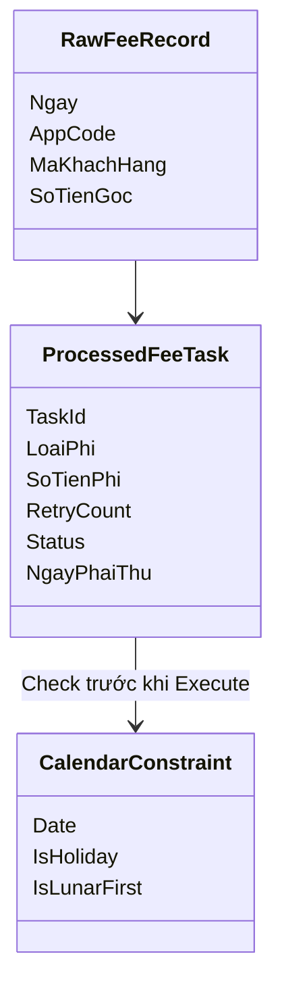
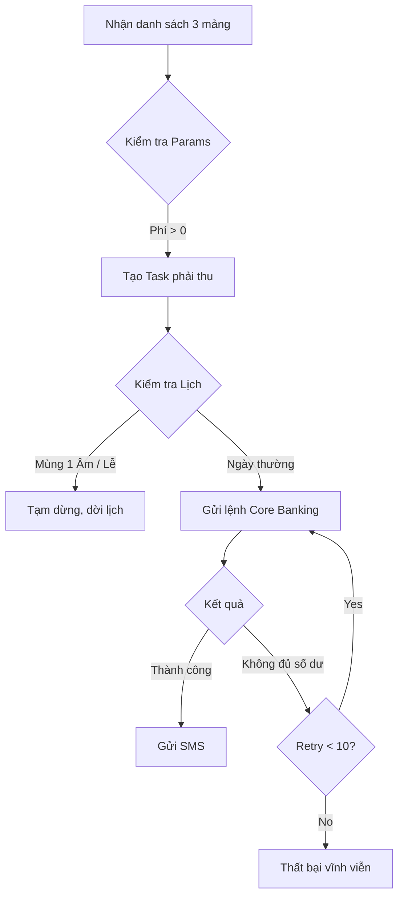

# Analysis

This file analyses [Requirements.md](Requirements.md). 

## 1. Domain model

| Entity | Responsibility | Notes |
|---|---|---|
| `RawFeeRecord` | Input ban đầu | AppCode cụ thể: Digibank, Thẻ, IB TC. |
| `ProcessedFeeTask` | Xử lý trung gian | Chứa `LoaiPhi`, `SoTienPhi`, `RetryCount`, `Status`, `NgayPhaiThu`. |
| `CalendarConstraint` | Policy / Rule | Chứa logic xác định mùng 1 Âm lịch và Nghỉ lễ. |
| `FeeReport` | Kết quả tra cứu | Xuất 3 loại báo cáo: Chi tiết, Tổng hợp, Không đủ số dư (US-06). |

## 2. Business rules

| ID | Rule | Stories |
|---|---|---|
| BR-01 | Khoản thu chỉ hợp lệ để xử lý nếu `Số tiền > 0` sau miễn giảm. | US-01 |
| BR-02 | **TUYỆT ĐỐI KHÔNG** phát sinh giao dịch trích nợ vào mùng 1 Âm lịch và ngày Nghỉ lễ. | US-02 |
| BR-03 | Lỗi "Không đủ số dư" kích hoạt vòng lặp Retry (Max 10 lần). | US-04 |
| BR-04 | Thu thành công bắt buộc phải trigger SMS. | US-05 |
| BR-05 | Dữ liệu phải được hiển thị trực quan qua 1 màn hình tra cứu. | US-06 |

## 3. Flows

## 4. Open assumptions

| ID | Topic | What is known | What is open |
|---|---|---|---|
| OA-01 | Scope Out | Hoàn phí, thu tiền mặt, hạch toán kế toán | Chi tiết xem [Domain.md - Out of Scope](Domain.md#2-out-of-scope) |
| OA-05 | Cơ chế dời lịch (Reschedule) | Không thu vào Lễ / mùng 1 Âm lịch. | Nếu bị dời lịch, hệ thống sẽ tự động chạy bù vào ngày làm việc tiếp theo, hay gộp vào kỳ thu của tháng sau? (Giả định: Chạy bù vào ngày làm việc kế tiếp). |
| OA-06 | Nguồn dữ liệu Lịch | Cần chặn theo Âm lịch. | Ngân hàng có sẵn internal API cho Âm lịch/Lễ, hay hệ thống này phải tự build một bảng Calendar Config riêng? |
