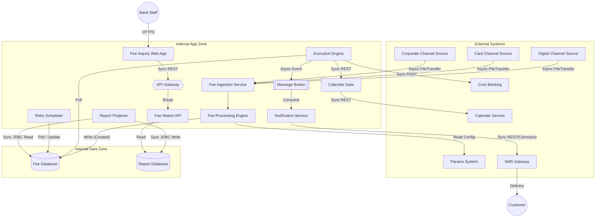

# Lab 6: Integration Ecosystem

**Project:** Bank Service Fee Collection System
**Phase:** Before Modeling (Messy) - Lab 6
**Note:** Informal integration map capturing connections based on Lab 1 (I-3, I-4, I-8). No formal ArchiMate/C4 standards applied.

---

## 1. Ecosystem Overview (As-Is / Current Style)

---

## 2. Integration Pathways Summary

*   **Ingestion Path (Async):** Channel sources push data to the `Fee Ingestion Service`.
*   **Validation Path (Sync):** `Fee Processing Engine` calls `Params System`; `Calendar Gate` calls `Calendar Service`.
*   **Execution Path (Sync):** `Execution Engine` dispatches debits directly to `Core Banking`.
*   **Event Path (Async):** `Execution Engine` -> `Message Broker` -> `Notification Service` -> `SMS Gateway`.
*   **CQRS Sync Path (Sync/Polling):** `Report Projector` continuously mirrors state from `Fee Database` to `Report Database`.
*   **Inquiry Path (Sync):** `Fee Inquiry Web App` -> `API Gateway` -> `Fee Report API` -> `Report Database`.
