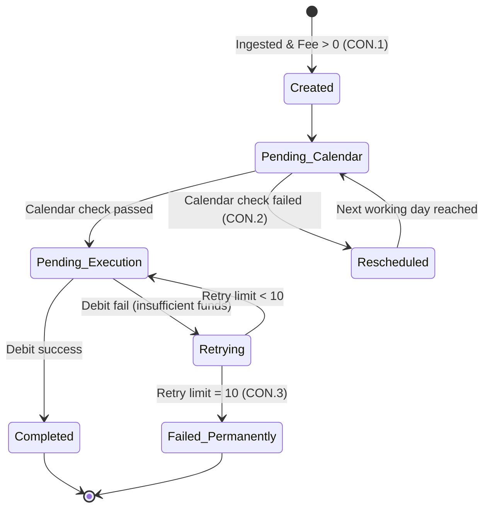
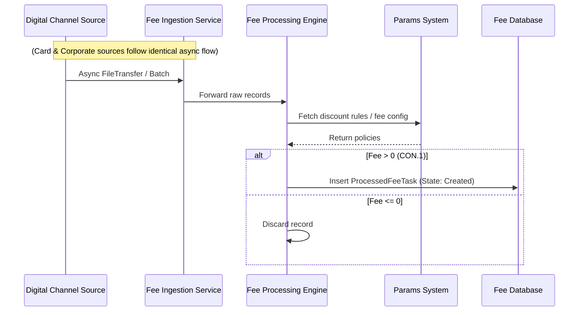
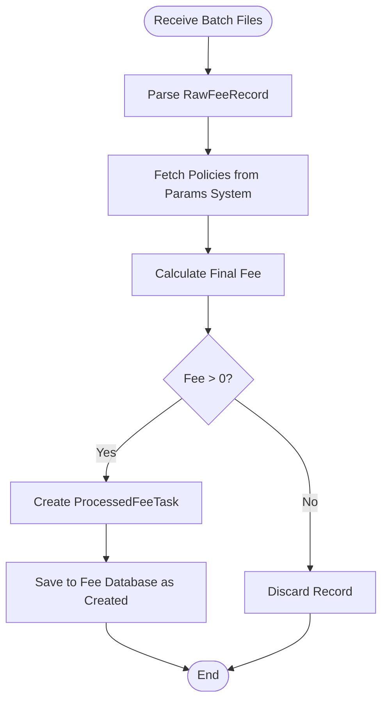
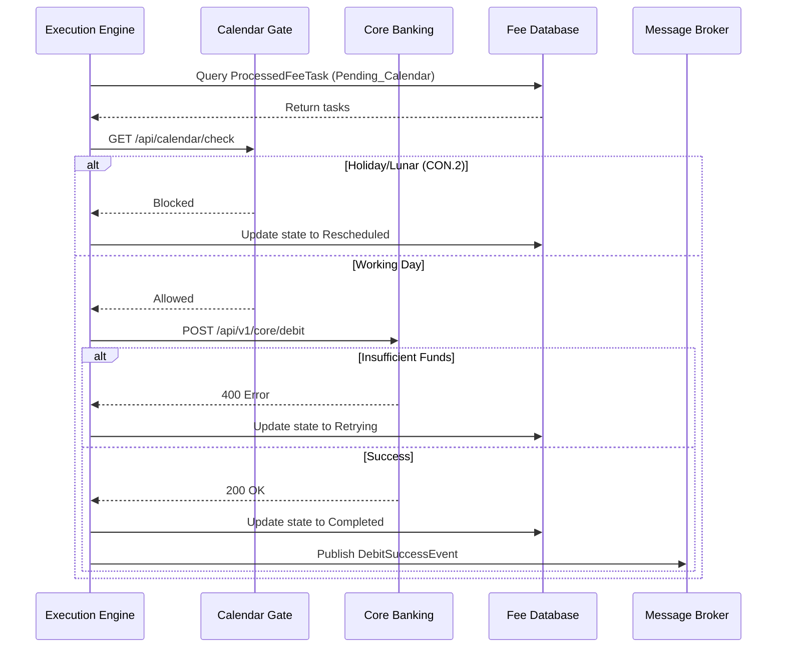
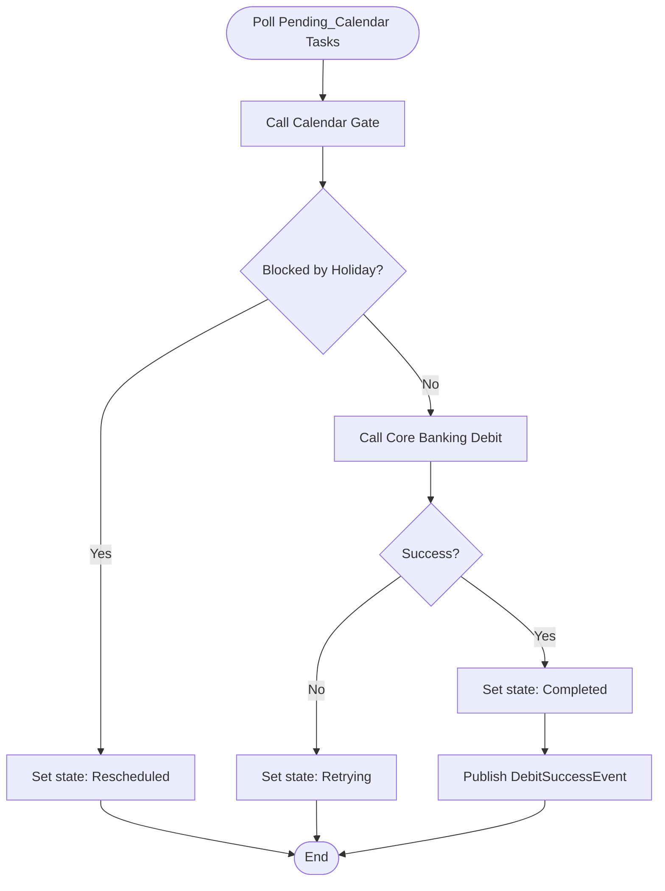
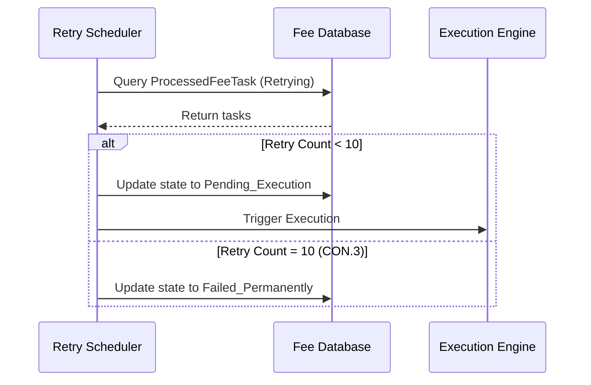
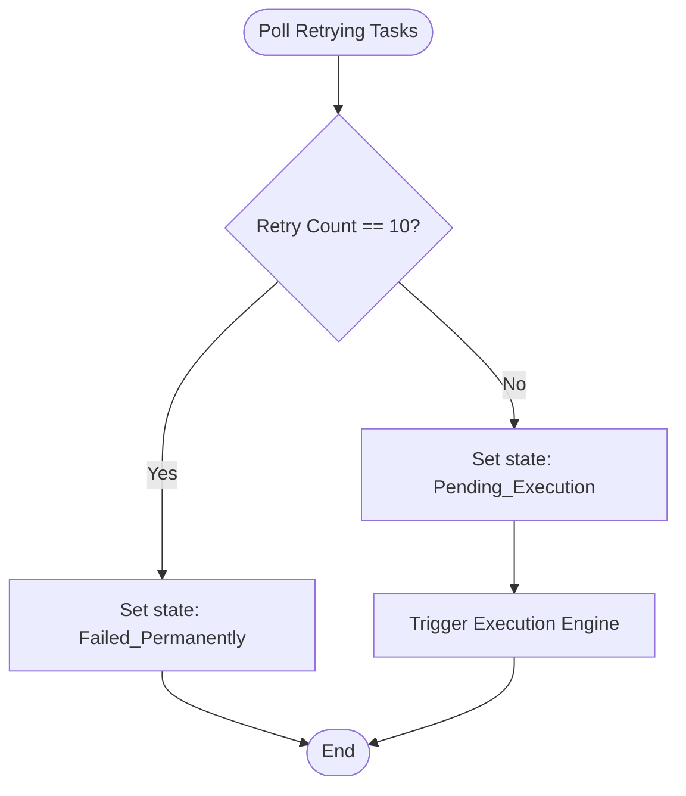
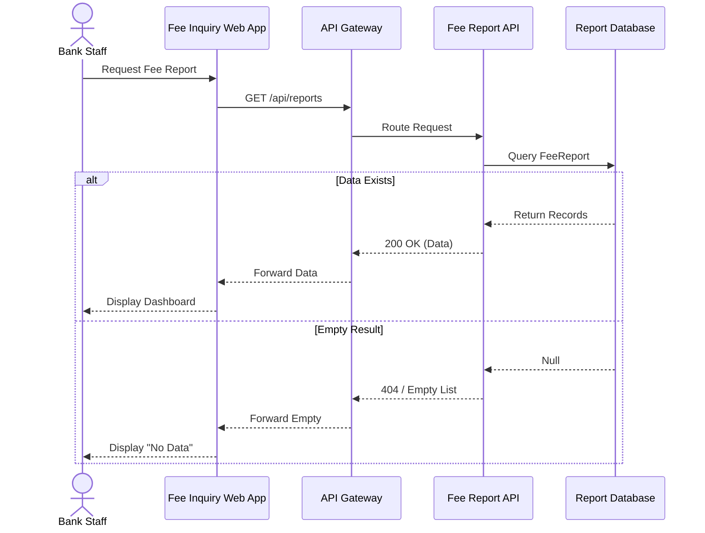
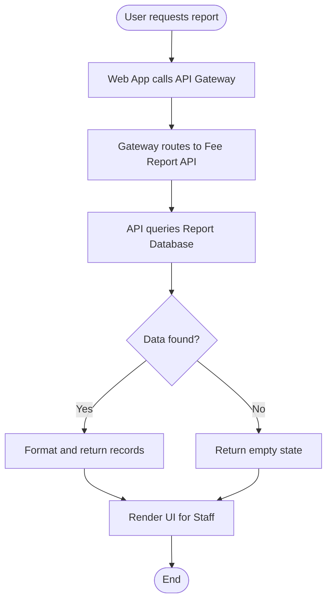

# Lab 10: System Modeling (UML Standardized)

**Project:** Bank Service Fee Collection System
**Phase:** After Pack (The Guide) - Lab 10
**Note:** Restyled from archived Lab 5. Explicitly strictly enforces Quality Gates G5 & G6, accurate C4 container strings, and mandatory Diagram Headers.

---

## 1. State Machine Diagram
*Satisfies G2 and G6: Exact I-6 states for ProcessedFeeTask.*

```text
Title:      State Machine - ProcessedFeeTask
Viewpoint:  UML
Layer(s):   Application
As-Is | To-Be | Transition:  To-Be
Owner:      Role Test ________  Name Hàn Ngọc Đức
RACI:       R Hàn Ngọc Đức  A Nguyễn Nhật Trường  C Hà Ngọc Bắc  I Dương Đỗ Minh
Version:    v1.0  Date 2026-08-22  Status Approved
Legend:     Arrows = State transitions | Brackets = Guards/Constraints
RACI legend: R = draws · A = approves · C = consulted · I = informed
Scope:      In-scope: ProcessedFeeTask lifecycle explicitly mapping to CON.1-CON.3
```



---

## 2. UC-Ingestion

### 2.1 Sequence Diagram
```text
Title:      UC-Ingestion Sequence Diagram
Viewpoint:  UML
Layer(s):   Application
As-Is | To-Be | Transition:  To-Be
Owner:      Role Dev ________  Name Dương Đỗ Minh
RACI:       R Dương Đỗ Minh  A Hà Ngọc Bắc  C Nguyễn Nhật Trường  I Hàn Ngọc Đức
Version:    v1.0  Date 2026-08-22  Status Approved
Legend:     Solid = Sync call | Dashed = Return/Async | alt = Exception path
RACI legend: R = draws · A = approves · C = consulted · I = informed
Scope:      In-scope: Ingestion workflow and CON.1 exception handling
```



### 2.2 Activity Diagram
```text
Title:      UC-Ingestion Activity Diagram
Viewpoint:  UML
Layer(s):   Application
As-Is | To-Be | Transition:  To-Be
Owner:      Role Test ________  Name Hàn Ngọc Đức
RACI:       R Hàn Ngọc Đức  A Nguyễn Nhật Trường  C Hà Ngọc Bắc  I Dương Đỗ Minh
Version:    v1.0  Date 2026-08-22  Status Approved
Legend:     Diamonds = Decisions | Rectangles = Actions
RACI legend: R = draws · A = approves · C = consulted · I = informed
Scope:      In-scope: Ingestion logic flow
```



---

## 3. UC-Execution

### 3.1 Sequence Diagram
```text
Title:      UC-Execution Sequence Diagram
Viewpoint:  UML
Layer(s):   Application
As-Is | To-Be | Transition:  To-Be
Owner:      Role Dev ________  Name Dương Đỗ Minh
RACI:       R Dương Đỗ Minh  A Hà Ngọc Bắc  C Nguyễn Nhật Trường  I Hàn Ngọc Đức
Version:    v1.0  Date 2026-08-22  Status Approved
Legend:     Solid = Sync call | Dashed = Return/Async | alt = Exception path
RACI legend: R = draws · A = approves · C = consulted · I = informed
Scope:      In-scope: Core execution, Calendar validation (CON.2), and Event dispatch
```



### 3.2 Activity Diagram
```text
Title:      UC-Execution Activity Diagram
Viewpoint:  UML
Layer(s):   Application
As-Is | To-Be | Transition:  To-Be
Owner:      Role Test ________  Name Hàn Ngọc Đức
RACI:       R Hàn Ngọc Đức  A Nguyễn Nhật Trường  C Hà Ngọc Bắc  I Dương Đỗ Minh
Version:    v1.0  Date 2026-08-22  Status Approved
Legend:     Diamonds = Decisions | Rectangles = Actions
RACI legend: R = draws · A = approves · C = consulted · I = informed
Scope:      In-scope: Execution logic flow and CON.2 enforcement
```



---

## 4. UC-AutoRetry

### 4.1 Sequence Diagram
```text
Title:      UC-AutoRetry Sequence Diagram
Viewpoint:  UML
Layer(s):   Application
As-Is | To-Be | Transition:  To-Be
Owner:      Role Dev ________  Name Dương Đỗ Minh
RACI:       R Dương Đỗ Minh  A Hà Ngọc Bắc  C Nguyễn Nhật Trường  I Hàn Ngọc Đức
Version:    v1.0  Date 2026-08-22  Status Approved
Legend:     Solid = Sync call | Dashed = Return | alt = Exception path
RACI legend: R = draws · A = approves · C = consulted · I = informed
Scope:      In-scope: AutoRetry constraint enforcement (CON.3)
```



### 4.2 Activity Diagram
```text
Title:      UC-AutoRetry Activity Diagram
Viewpoint:  UML
Layer(s):   Application
As-Is | To-Be | Transition:  To-Be
Owner:      Role Test ________  Name Hàn Ngọc Đức
RACI:       R Hàn Ngọc Đức  A Nguyễn Nhật Trường  C Hà Ngọc Bắc  I Dương Đỗ Minh
Version:    v1.0  Date 2026-08-22  Status Approved
Legend:     Diamonds = Decisions | Rectangles = Actions
RACI legend: R = draws · A = approves · C = consulted · I = informed
Scope:      In-scope: AutoRetry logic flow
```



---

## 5. UC-Inquiry

### 5.1 Sequence Diagram
```text
Title:      UC-Inquiry Sequence Diagram
Viewpoint:  UML
Layer(s):   Application
As-Is | To-Be | Transition:  To-Be
Owner:      Role Dev ________  Name Dương Đỗ Minh
RACI:       R Dương Đỗ Minh  A Hà Ngọc Bắc  C Nguyễn Nhật Trường  I Hàn Ngọc Đức
Version:    v1.0  Date 2026-08-22  Status Approved
Legend:     Solid = Sync call | Dashed = Return | alt = Conditional path
RACI legend: R = draws · A = approves · C = consulted · I = informed
Scope:      In-scope: CQRS Report read flow
```



### 5.2 Activity Diagram
```text
Title:      UC-Inquiry Activity Diagram
Viewpoint:  UML
Layer(s):   Application
As-Is | To-Be | Transition:  To-Be
Owner:      Role Test ________  Name Hàn Ngọc Đức
RACI:       R Hàn Ngọc Đức  A Nguyễn Nhật Trường  C Hà Ngọc Bắc  I Dương Đỗ Minh
Version:    v1.0  Date 2026-08-22  Status Approved
Legend:     Diamonds = Decisions | Rectangles = Actions
RACI legend: R = draws · A = approves · C = consulted · I = informed
Scope:      In-scope: Inquiry logic flow
```



---

## 6. G5 & G6 Coverage Note (Test & Exception Matrix)
*Verifies compliance with Quality Gates G5 (Critical exceptions) and G6 (Test coverage).*

**G5 Compliance (Critical Exception Paths):**
- [x] **CON.1 (Fee <= 0):** Visually modeled in `UC-Ingestion` (`alt` branch dropping the task).
- [x] **CON.2 (Holiday/Lunar Block):** Visually modeled in `UC-Execution` (shifts to `Rescheduled`).
- [x] **CON.3 (AutoRetry Max 10):** Visually modeled in `UC-AutoRetry` (limits retries, shifts to `Failed_Permanently`).

**G6 Compliance (State & Sequence Coverage mapping to Lab 3 TS-xx):**
- [x] Transition: `Created` -> `Pending_Calendar` (Test ID: TS-02)
- [x] Transition: `Pending_Calendar` -> `Pending_Execution` (Test ID: TS-05)
- [x] Transition: `Pending_Calendar` -> `Rescheduled` (Test ID: TS-04)
- [x] Transition: `Rescheduled` -> `Pending_Calendar` (Test ID: TS-09)
- [x] Transition: `Pending_Execution` -> `Retrying` (Test ID: TS-07)
- [x] Transition: `Pending_Execution` -> `Completed` (Test ID: TS-08)
- [x] Transition: `Retrying` -> `Pending_Execution` (Test ID: TS-10)
- [x] Transition: `Retrying` -> `Failed_Permanently` (Test ID: TS-12)
- [x] UC-Ingestion `alt`: Fee <= 0 (CON.1) (Test ID: TS-01)
- [x] UC-Execution `alt`: Holiday/Lunar Block (CON.2) (Test ID: TS-03)
- [x] UC-Execution `alt`: Insufficient Funds (Test ID: TS-06)
- [x] UC-AutoRetry `alt`: Exceed max 10 retries (CON.3) (Test ID: TS-11)

---

## 7. Comparison Note (Lab 5 Messy vs Lab 10 Standardized)
*   **Name Identity & System Grain:** Ở Lab 5, các lifelines còn mang tính tự do/lộn xộn (ví dụ sử dụng `TaskPoller`, `DebitDispatcher`, gộp kênh `Digital / Card / Corp Channels`). Ở Lab 10, toàn bộ lifelines đã được audit và quy chuẩn 100% về tên C4 Container và External Systems đã chốt ở Lab 1/Lab 9.
*   **Governance & RACI:** Lab 5 hoàn toàn không có Header hay RACI (giai đoạn Messy). Sang Lab 10, mỗi bản vẽ đều được đóng dấu Diagram Header tiêu chuẩn với phân vai rõ ràng: Dev vẽ và SA duyệt Sequence; Test vẽ và BA duyệt Activity/State, đảm bảo tính khách quan (R ≠ A).
*   **Traceability & Quality Gates:** Lab 10 chuẩn hóa hoàn toàn các đường rẽ nhánh `alt` tương ứng với các ràng buộc CON.1, CON.2, CON.3 (đạt chuẩn G5), đồng thời có bảng đối chiếu G6 Test Coverage liên kết trực tiếp với mã kịch bản kiểm thử từ Lab 3.
