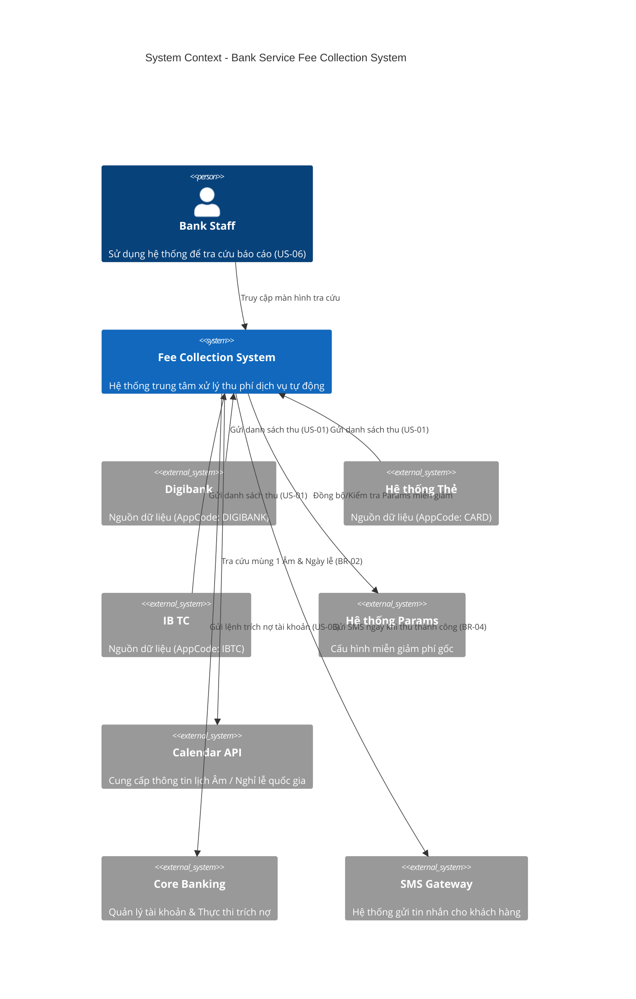
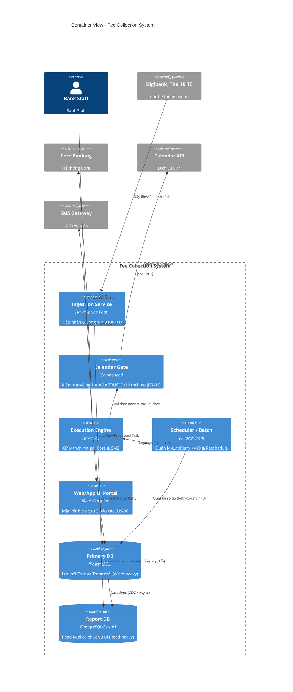

# Architecture Design - Bank Service Fee Collection System

**Source of truth:** [Domain.md](Domain.md), [Requirements.md](Requirements.md), [Analysis.md](Analysis.md)

## A1. System Context (C4 Level 1)
Scope: Thu thập danh sách phí từ Digibank, Thẻ, IB TC. Tích hợp Calendar API để chặn lịch Âm/Lễ. 
*Out of scope: Hạch toán kế toán, thu tiền mặt, tạo tham số miễn giảm, hoàn phí (Refund).*

## A2 & A5. Container View (C4 Level 2) & Read/Write Split
Kiến trúc áp dụng **Read/Write Split (CQRS pattern)**: Màn hình UI của Bank Staff tuyệt đối không query trực tiếp vào Core Banking hay Primary DB (tránh lock DB khi hệ thống đang cày batch trích nợ), mà đọc từ Report Read DB riêng biệt.

## A3. Calendar Gate
- **Vai trò:** Hoạt động như một chốt chặn (Circuit Breaker logic) đặt **TRƯỚC** Fee Execution Engine.
- **Quy tắc tuyệt đối (BR-02):** Engine phải đi qua Calendar Gate. Gate sẽ kiểm tra xem ngày hệ thống hiện tại có phải là mùng 1 Âm lịch hoặc nghỉ lễ không bằng cách gọi `Calendar API`.
- **Nếu YES:** Ngăn chặn ngay lập tức, đổi trạng thái lô thu sang `Rescheduled` sang ngày làm việc tiếp theo. Core Banking tuyệt đối không nhận được request nào trong ngày này.
- **Chống Anti-pattern:** Logic Âm lịch KHÔNG bị hardcode mà phụ thuộc vào Master Data hoặc External Calendar API.

## A4. Scheduler / Batch (AutoRetry)
- **Cơ chế (BR-03 & US-04):** Job Scheduler định kỳ quét các `ProcessedFeeTask` có trạng thái `INSUFFICIENT_FUNDS`.
- Nếu `RetryCount < 10`, Batch sẽ đẩy task trở lại Queue cho Execution Engine xử lý.
- Nếu `RetryCount >= 10`, Task bị đánh dấu là `PERMANENT_FAIL` và bỏ qua (chỉ hiển thị lên UI báo cáo).
- Lập lịch dời ngày (Reschedule): Nếu Calendar Gate báo lỗi Lễ, Scheduler tự động đẩy `NgayPhaiThu` sang `NgayPhaiThu + 1 working day`.

## A6. SMS Gateway Integration
- **Cơ chế (BR-04 & US-05):** Execution Engine được liên kết trực tiếp (Synchronous hoặc High-priority Asynchronous) với SMS Gateway.
- Ngay khi Core Banking trả về `Success` (Đã trừ tiền), Engine gọi ngay hàm `SendSMS()` rồi mới đóng Task. Đảm bảo trải nghiệm tức thời cho khách hàng.

## A7. Open Assumptions
| ID | Topic | Quyết định trong Kiến trúc này |
|---|---|---|
| **OA-01** | Phạm vi (Scope Out) | Không có module Hạch toán, Không tích hợp hệ thống Thu tiền mặt, Không có module Hoàn phí (Refund UI). |
| **OA-05** | Cơ chế dời lịch (Reschedule) | Thiết kế `Scheduler / Batch` xử lý dời sang **ngày làm việc tiếp theo** thay vì cộng dồn vào tháng sau. |
| **OA-06** | Nguồn dữ liệu Lịch | Dùng **Calendar API** nội bộ hiện có của ngân hàng làm System External (Không tự build bảng mapping ngày Âm lịch để tránh sai lệch rủi ro). |
