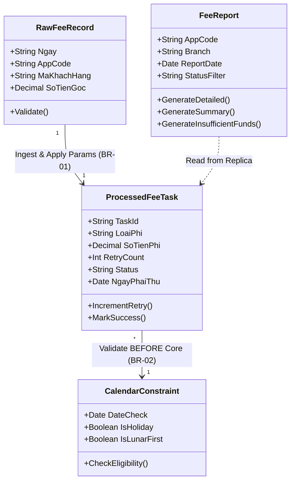
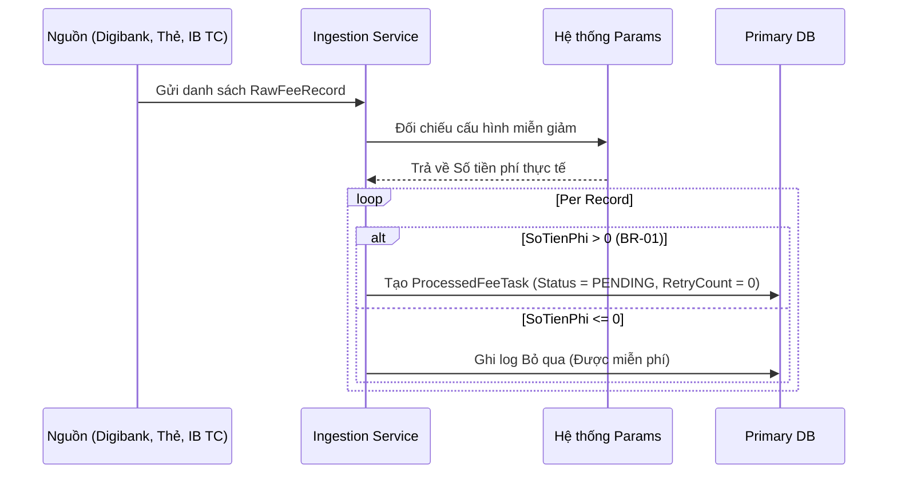
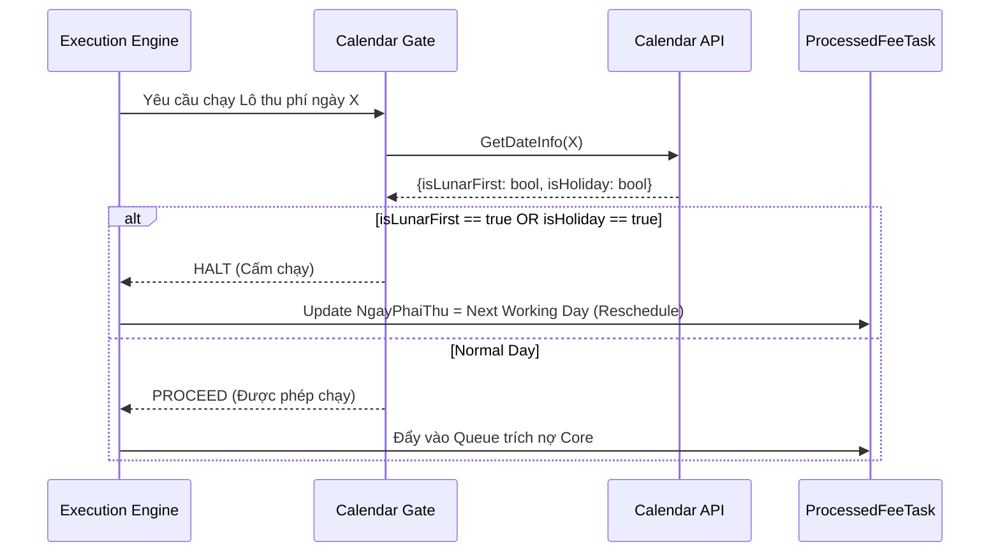
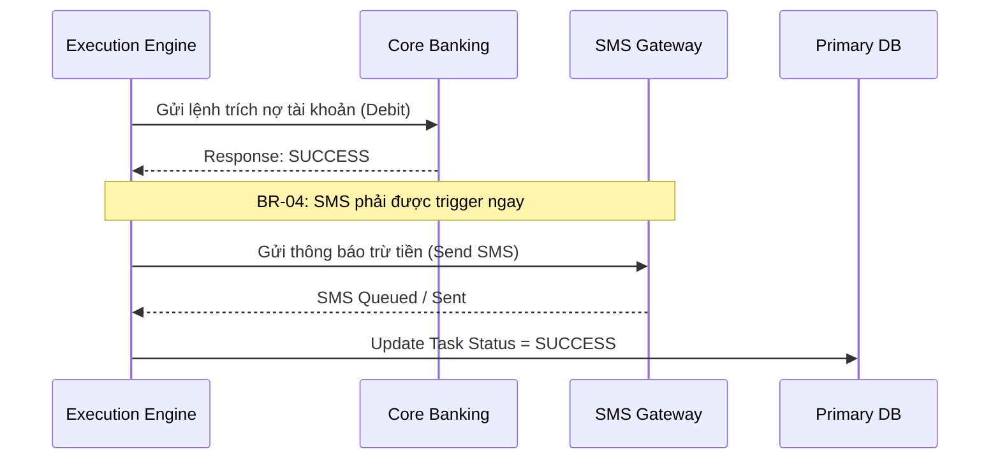
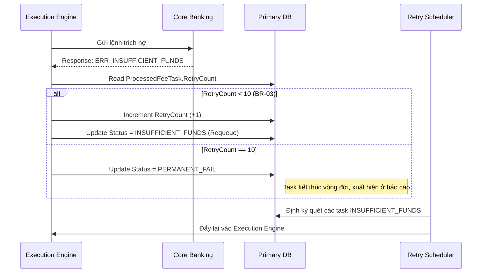

# Detailed Logical Design - Bank Service Fee Collection System

**Source of truth:** [Domain.md](Domain.md), [Requirements.md](Requirements.md), [Analysis.md](Analysis.md)

## D1. Scope
- **Domain Base:** Dựa trên định nghĩa hệ thống tại [Domain.md](Domain.md).
- **In-scope Items:** Xử lý US-01 đến US-06.
- **Nguồn dữ liệu (AppCodes):** Digibank (`DIGIBANK`), Thẻ (`CARD`), Internet Banking Tổ chức (`IBTC`).
- **Nghiêm ngặt:** Tuân thủ từ BR-01 đến BR-05.

## D2. Domain / Class Design
Mô hình cấu trúc dữ liệu lõi đảm bảo lưu đủ thông tin loại phí, số lần retry và các báo cáo nghiệp vụ.



---

## Các luồng Sequence Diagrams

### D3. Sequence — Ingestion (US-01, BR-01)
Tiếp nhận file/dữ liệu từ 3 mảng và chỉ xử lý các khoản có phí thực tế > 0.



### D4. Sequence — Calendar Check (US-02, BR-02)
**BẮT BUỘC:** Chặn mùng 1 Âm lịch và Nghỉ lễ TRƯỚC KHI gọi Core.



### D5. Sequence — Execution & SMS (US-03, US-05, BR-04)
Thực thi thu phí trên Core và gửi SMS NGAY LẬP TỨC khi thành công.



### D6. Sequence — AutoRetry (US-04, BR-03)
Xử lý lỗi số dư (Insufficient funds) với cơ chế RetryCount <= 10.



---

### D7. UI Wireframe / Flow (US-06)
Sử dụng Read Replica để tránh can thiệp vào luồng Core. Giao diện thiết kế cho **Bank Staff**.

```mermaid
flowchart TD
    User[Bank Staff] -->|Truy cập| UI[Màn hình Tra cứu Thu Phí]
    
    UI --> Filter[Bộ lọc: AppCode, Chi nhánh, Ngày, Status]
    Filter --> ReadDB[(Report Read DB)]
    ReadDB -->|Query Results| UI
    
    UI --> Rep1[Báo cáo Chi tiết Giao dịch]
    UI --> Rep2[Báo cáo Tổng hợp (Theo Chi nhánh/App)]
    UI --> Rep3[Danh sách Không đủ số dư (Lỗi)]
```

---

## D8. BR Evidence Table

| BR | Rule (short) | Evidence (Diagram / Section) | Priority |
|---|---|---|---|
| **BR-01** | Chỉ thu khoản có Số tiền > 0 | D3. Sequence — Ingestion (US-01) | Must |
| **BR-02** | Chặn mùng 1 Âm lịch / Lễ (TUYỆT ĐỐI) | D4. Sequence — Calendar Check (US-02) | **Critical** |
| **BR-03** | Lỗi số dư kích hoạt Retry ≤ 10 | D6. Sequence — AutoRetry (US-04) | Must |
| **BR-04** | Thu thành công gửi SMS ngay lập tức | D5. Sequence — Execution & SMS (US-05) | Must |
| **BR-05** | Có màn hình tra cứu 3 báo cáo | D7. UI Wireframe / Flow (US-06) | Must |

---

## Out of Scope (Kiểm soát biên hệ thống)
Các tính năng sau **TUYỆT ĐỐI KHÔNG** tồn tại trong thiết kế của hệ thống này, đảm bảo không vi phạm Anti-pattern Out of Scope:
1. **Hạch toán kế toán tổng hợp:** Giao dịch qua Core là trích nợ đơn lẻ, bút toán sổ cái do hệ thống Kế toán chạy cuối ngày.
2. **Thu phí tiền mặt tại quầy:** Không liên quan đến luồng `ProcessedFeeTask`.
3. **Hoàn phí (Refund):** UI ở D7 không có nút/chức năng "Hoàn tiền". Mọi yêu cầu hoàn tiền xử lý tay ngoài hệ thống.
4. **Tạo/Quản lý tham số miễn giảm:** Hệ thống Ingestion (D3) chỉ *Đọc (Read)* từ Hệ thống Params, không cung cấp UI để sửa Params.
5. **Phân quyền user phức tạp:** Toàn bộ Bank Staff vào chung 1 Role "Viewer" đối với D7.
