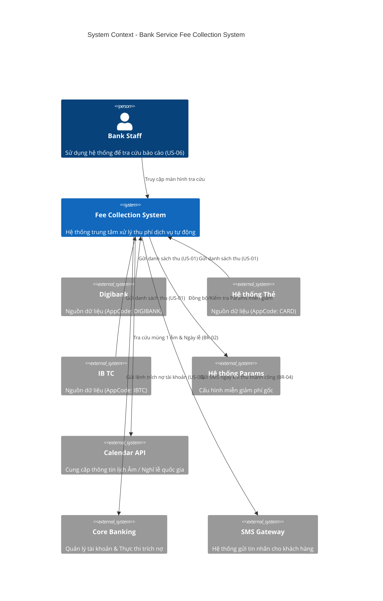

# 05. C4 Context Diagram

## 1. Diagram

## 2. Description
Hệ thống `Fee Collection System` đứng ở vị trí trung tâm, giao tiếp với các hệ thống nguồn để nhận dữ liệu, qua `Calendar API` để validate ngày hợp lệ, và thực thi các nghiệp vụ trừ tiền qua `Core Banking`.
