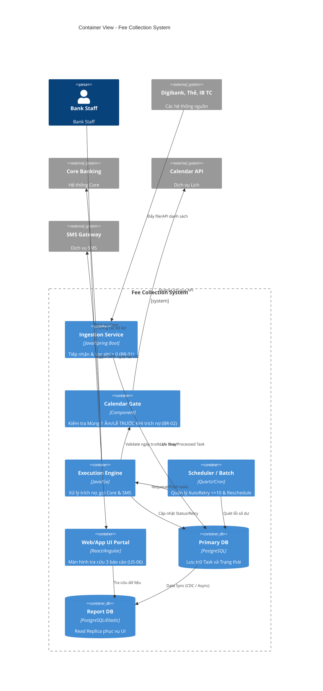

# 06. C4 Container Diagram

## 1. Diagram

## 2. Component Highlights
Áp dụng **Read/Write Split (CQRS pattern)**: Web/App UI Portal query từ Report Read DB riêng biệt, đảm bảo không khóa bảng khi luồng trích nợ đang cày batch.
