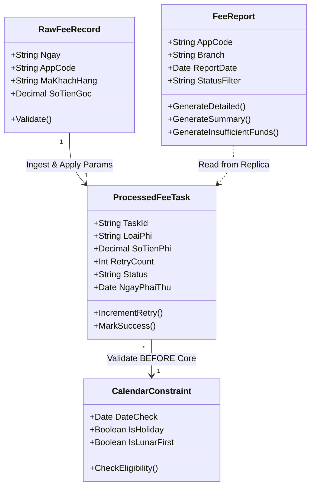

# 10. UML Domain & Class Diagram

## 1. Domain Model

## 2. Attribute Details
- `ProcessedFeeTask`: Entity cốt lõi lưu trữ trạng thái xử lý trung gian, số lần retry, loại phí và ngày phải thu (có thể thay đổi khi dời lịch).
- `CalendarConstraint`: Object đảm bảo quy tắc nghiệp vụ giới hạn lịch trình thời gian thu phí.
