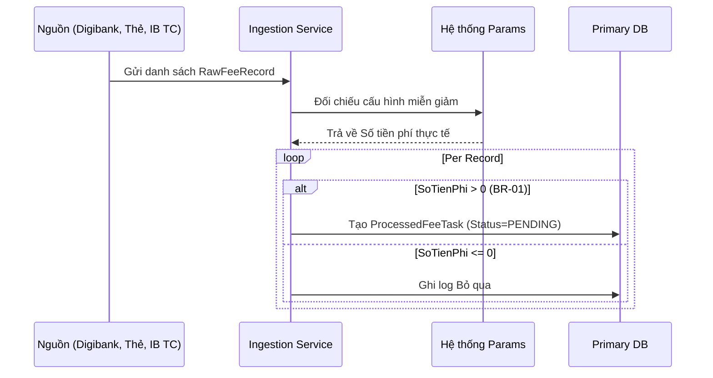
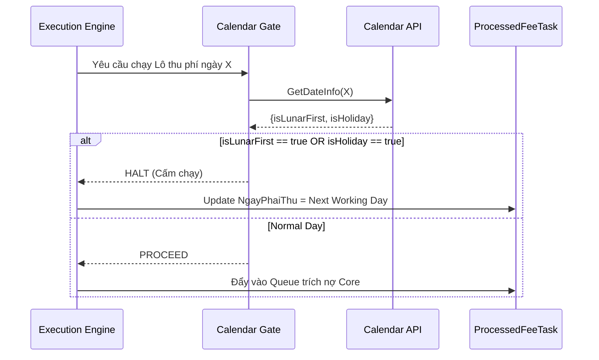
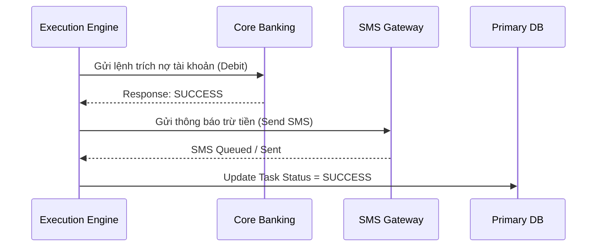
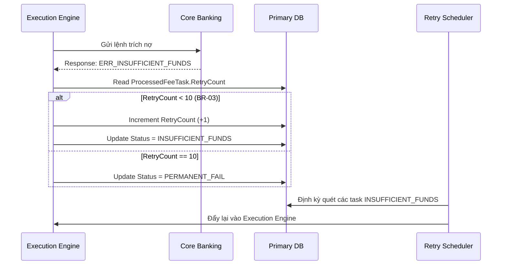

# 11. UML Sequence Diagrams

## 1. Sequence: Ingestion (US-01, BR-01)

## 2. Sequence: Calendar Check (US-02, BR-02)

## 3. Sequence: Execution & SMS (US-03, US-05)

## 4. Sequence: AutoRetry (US-04, BR-03)

