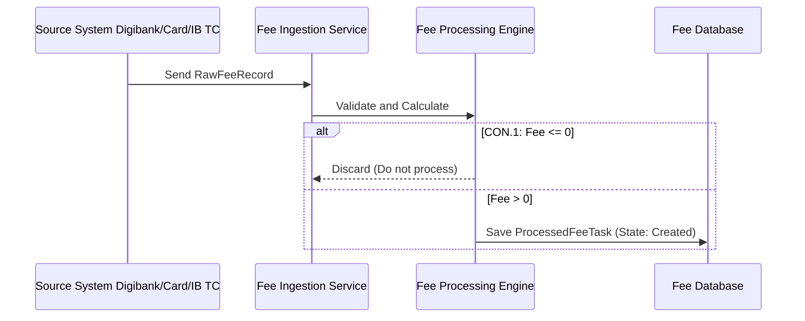
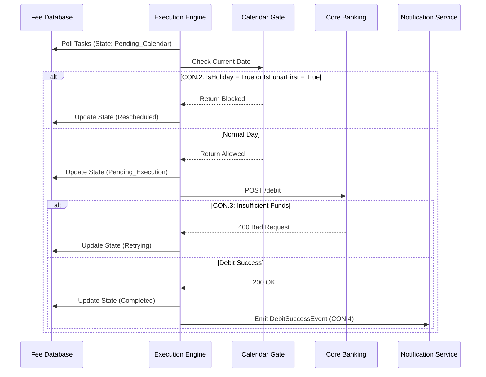
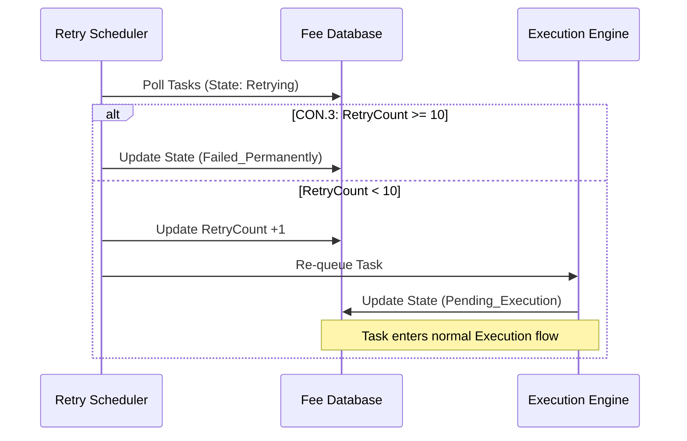

# Lab 5: UML Sequence Diagrams

**Project:** Bank Service Fee Collection System
**Phase:** Before Modeling (Messy) - Lab 5
*Note: One sequence diagram per named use case (I-11). Participants are strictly subsets of I-4 containers and I-3 externals.*

## UC-Ingestion: Tiếp nhận, kiểm tra Params, tạo Task phí >0

## UC-Execution: Qua Calendar Gate, gọi Core thành công, gửi SMS

## UC-AutoRetry: Retry Scheduler chạy

