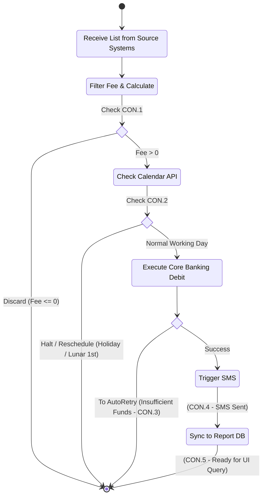

# Lab 5: UML Activity Diagram

**Project:** Bank Service Fee Collection System
**Phase:** Before Modeling (Messy) - Lab 5
*Note: Happy path matches I-5. Decisions show CON.* explicitly.*

## Main Process Flow

