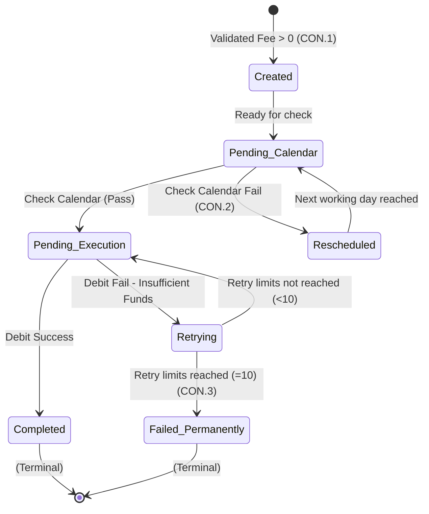

# Lab 5: UML State Diagram

**Project:** Bank Service Fee Collection System
**Phase:** Before Modeling (Messy) - Lab 5
*Note: Strictly ONE object per machine. States perfectly match I-6.*

## Object: `ProcessedFeeTask`

