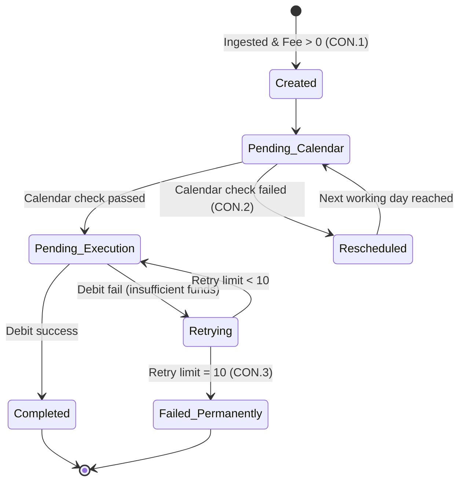
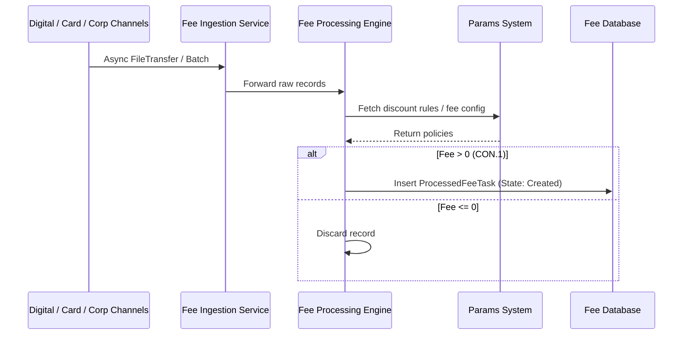
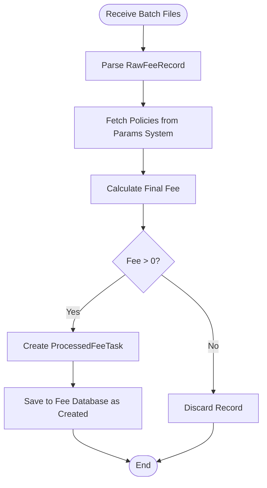
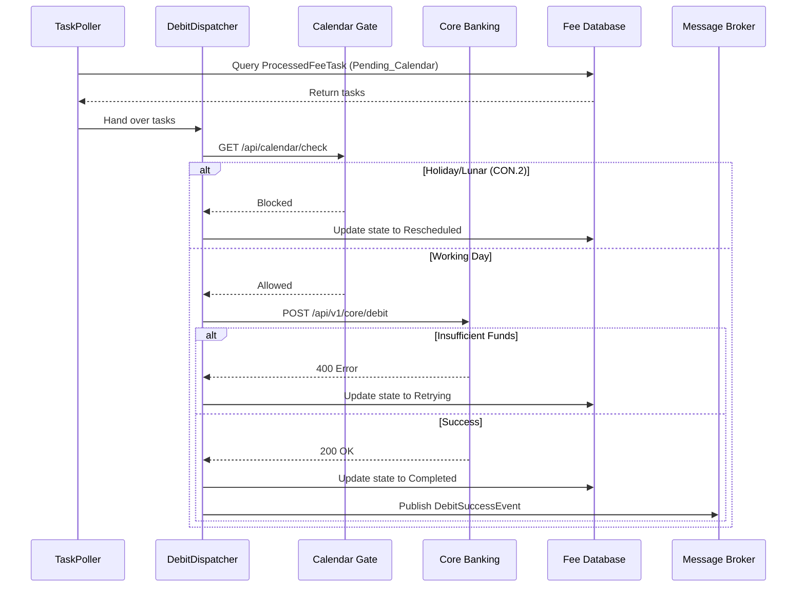
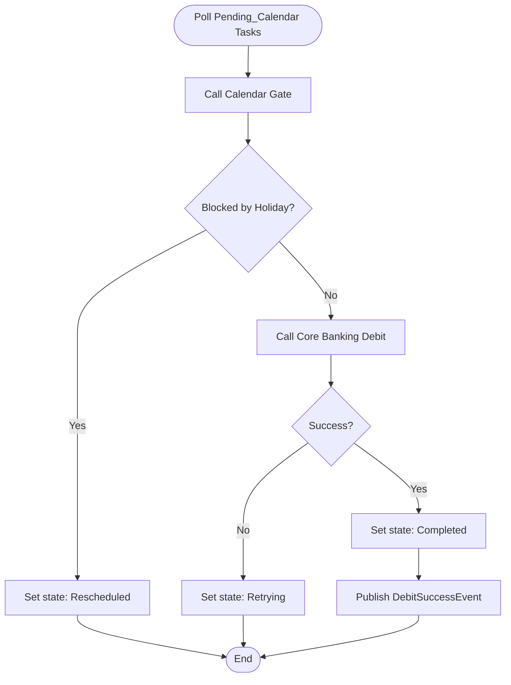
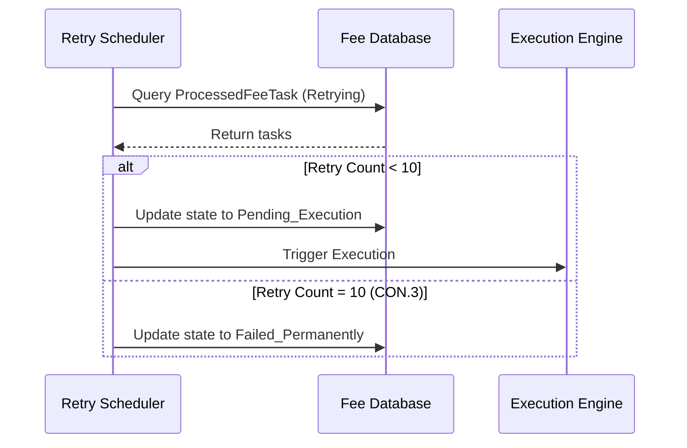
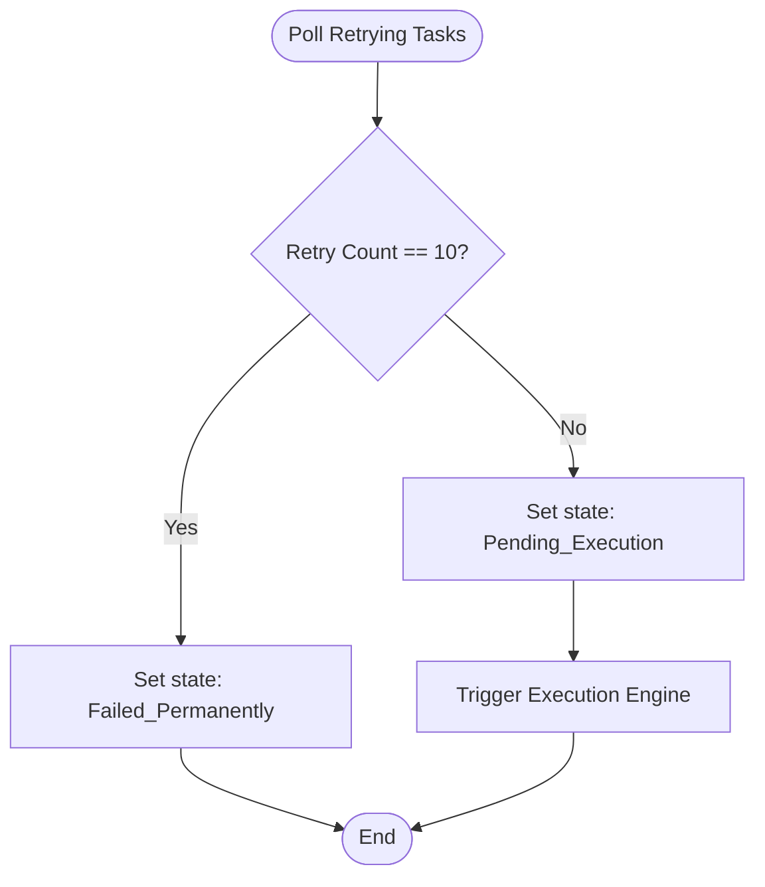
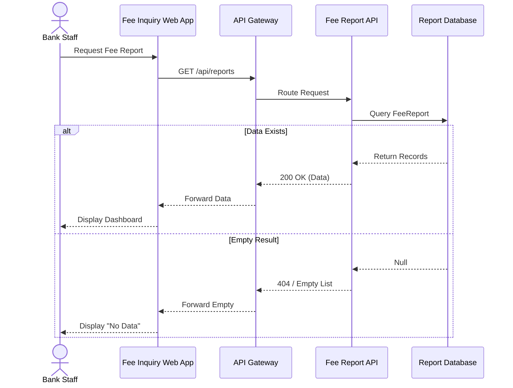
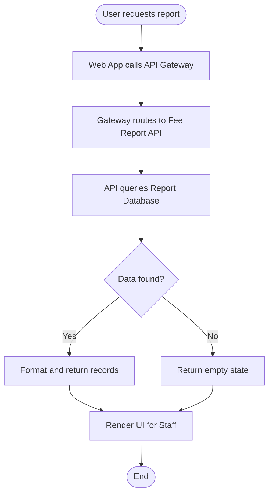

# Lab 5: Low-Level Design (UML)

**Project:** Bank Service Fee Collection System
**Phase:** Before Modeling (Messy) - Lab 5
**Note:** Generated for named I-11 use cases only, current style (no Guide, no RACI).

---

## 1. State Machine Diagram
**Object:** `ProcessedFeeTask`

---

## 2. UC-Ingestion

### 2.1 Sequence Diagram

### 2.2 Activity Diagram

---

## 3. UC-Execution

### 3.1 Sequence Diagram

### 3.2 Activity Diagram

---

## 4. UC-AutoRetry

### 4.1 Sequence Diagram

### 4.2 Activity Diagram

---

## 5. UC-Inquiry

### 5.1 Sequence Diagram

### 5.2 Activity Diagram

