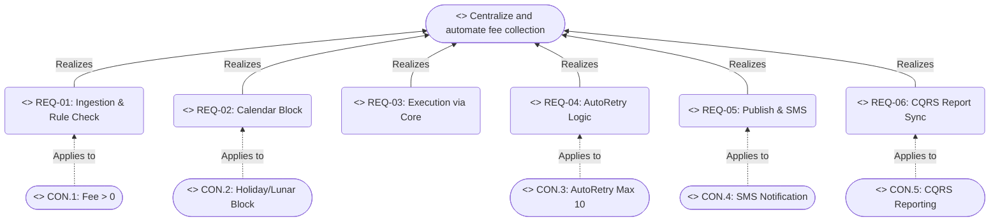
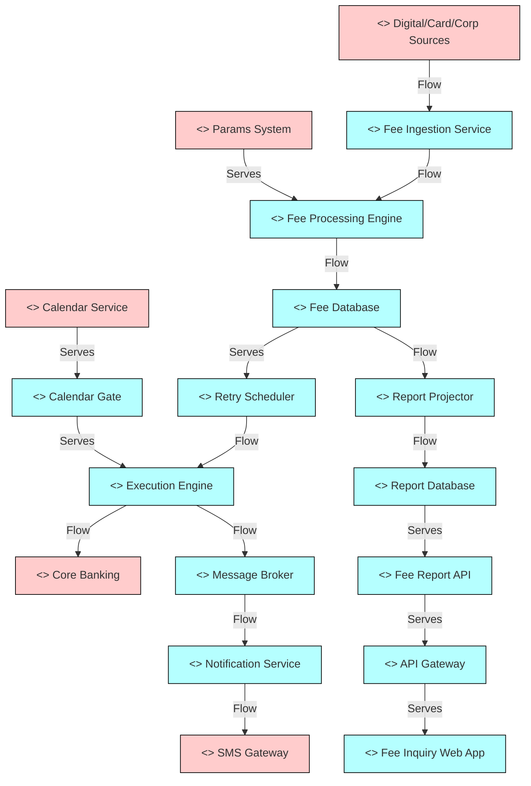
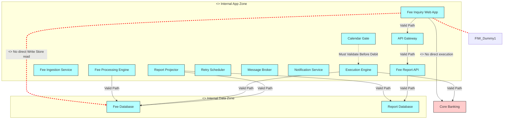

# Lab 8: System Modeling (ArchiMate)

**Project:** Bank Service Fee Collection System
**Phase:** After Pack (The Guide) - Lab 8
**Note:** Built strictly following the Quality Gates (G1, G2, G3) and Diagram Header Template defined in Lab 7. Includes 4 named ArchiMate views.

---

## 1. Motivation / Strategy View
*Designed to pass Quality Gate G1: Must explicitly list the goal and constraints CON.1 to CON.5, directly mapping to REQ-01, REQ-02, REQ-04, REQ-05, REQ-06.*

```text
Title:      Motivation & Strategy View
Viewpoint:  ArchiMate 
Layer(s):   Strategy / Motivation
As-Is | To-Be | Transition:  To-Be
Owner:      Role EA ________  Name Nguyễn Nhật Trường
RACI:       R EA__  A Owner_  C SA__  I Dev/Test
Version:    v1.0  Date 2026-08-21  Status Review
Legend:     Solid lines = Realization | Dotted lines = Constraint application
RACI legend: R = draws · A = approves · C = consulted · I = informed
Scope:      In-scope: Project Goal, Constraints (CON.1-5), Requirements (REQ-01-06)
```



---

## 2. Business Process View
*Designed to pass Quality Gate G2: Must use the exact states for ProcessedFeeTask and fulfill REQ-01 to REQ-05.*

```text
Title:      Fee Collection Business Process & States
Viewpoint:  ArchiMate
Layer(s):   Business
As-Is | To-Be | Transition:  To-Be
Owner:      Role BA ________  Name Nguyễn Nhật Trường
RACI:       R BA__  A SA____  C Test  I Dev_
Version:    v1.0  Date 2026-08-21  Status Review
Legend:     Rectangles = Business Process | Hexagons = Data Object States
RACI legend: R = draws · A = approves · C = consulted · I = informed
Scope:      In-scope: Business steps mapping to REQ-01 to REQ-05 and I-6 states.
```

```mermaid
flowchart TD
    %% Processes mapping to Requirements
    P1(<<Business Process>> Ingestion & Param Check [REQ-01])
    P2(<<Business Process>> Calendar Validation [REQ-02])
    P3(<<Business Process>> Core Debit Execution [REQ-03])
    P4(<<Business Process>> AutoRetry Evaluation [REQ-04])
    P5(<<Business Process>> Notification Dispatch [REQ-05])

    %% Exact States from I-6 (G2 Pass Rule)
    S_C[[<<Business Object>> ProcessedFeeTask : Created]]
    S_PC[[<<Business Object>> ProcessedFeeTask : Pending_Calendar]]
    S_R[[<<Business Object>> ProcessedFeeTask : Rescheduled]]
    S_PE[[<<Business Object>> ProcessedFeeTask : Pending_Execution]]
    S_RE[[<<Business Object>> ProcessedFeeTask : Retrying]]
    S_CO[[<<Business Object>> ProcessedFeeTask : Completed]]
    S_FP[[<<Business Object>> ProcessedFeeTask : Failed_Permanently]]

    %% Workflow and State Transitions
    P1 -->|Produces| S_C
    S_C -->|Progresses to| S_PC

    S_PC -->|Evaluated by| P2
    P2 -->|Block (CON.2)| S_R
    S_R -->|Wait next day| S_PC
    P2 -->|Allow| S_PE

    S_PE -->|Executed by| P3
    P3 -->|Debit Fail| S_RE
    P3 -->|Debit Success| S_CO

    S_RE -->|Evaluated by| P4
    P4 -->|Count < 10| S_PE
    P4 -->|Count = 10 (CON.3)| S_FP

    S_CO -->|Triggers| P5
```

---

## 3. Application Cooperation View
*Pure ArchiMate logic (No UML messages, no C4 combination). Shows Data Flow and Serving relationships between designated I-4 containers and I-3 external components.*

```text
Title:      Application Cooperation View
Viewpoint:  ArchiMate
Layer(s):   Application
As-Is | To-Be | Transition:  To-Be
Owner:      Role SA ________  Name Hà Ngọc Bắc
RACI:       R SA__  A EA____  C Dev_  I Test
Version:    v1.0  Date 2026-08-21  Status Review
Legend:     Blue = Internal Components | Pink = External Components | Lines = Flow / Serves
RACI legend: R = draws · A = approves · C = consulted · I = informed
Scope:      In-scope: I-4 internal containers & I-3 external systems relationships.
```



---

## 4. Technology / Hybrid View
*Demonstrates I-9 Deployment Locations and visually enforces the Forbidden Paths.*

```text
Title:      Technology & Deployment View (Forbidden Paths Validated)
Viewpoint:  ArchiMate
Layer(s):   Application / Technology (Hybrid)
As-Is | To-Be | Transition:  To-Be
Owner:      Role SA ________  Name Hà Ngọc Bắc
RACI:       R SA__  A EA____  C Dev_  I Sec/Ops
Version:    v1.0  Date 2026-08-21  Status Review
Legend:     Green dashed = Locations | Red bold lines = Forbidden Paths (Must NOT happen)
RACI legend: R = draws · A = approves · C = consulted · I = informed
Scope:      In-scope: I-9 App & Data Zones. Explicit modeling of forbidden DB/Core access.
```


