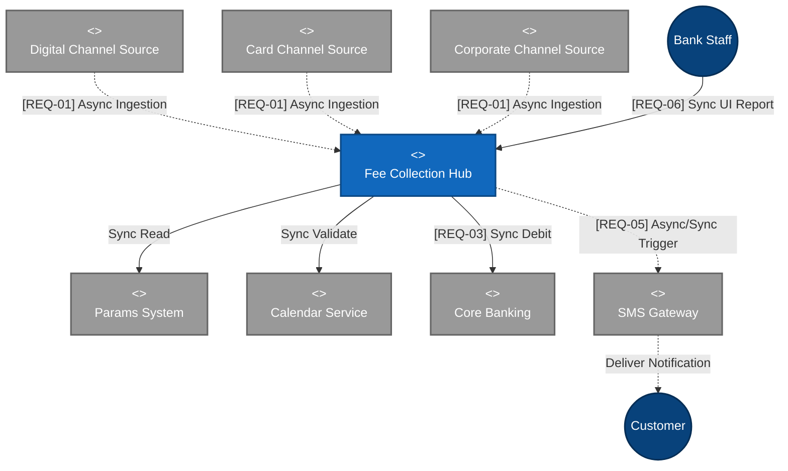
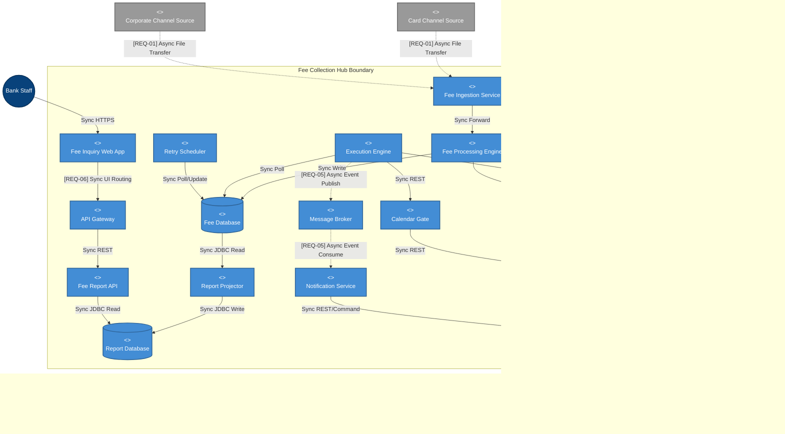

# Lab 9: System Modeling (C4 Context & Container)

**Project:** Bank Service Fee Collection System
**Phase:** After Pack (The Guide) - Lab 9
**Note:** Built strictly following Quality Gate G3 and Diagram Header Template defined in Lab 7.

---

## 1. C4 Level 1: System Context Diagram
*Demonstrates the overarching interactions between actors, the central system, and external systems.*

```text
Title:      C4 Context (Level 1) - Fee Collection Hub
Viewpoint:  C4 Model
Layer(s):   Business / Context
As-Is | To-Be | Transition:  To-Be
Owner:      Role SA ________  Name Hà Ngọc Bắc
RACI:       R SA__  A EA____  C Dev_  I Test
Version:    v1.0  Date 2026-08-21  Status Review
Legend:     Solid lines = Sync connections | Dashed lines = Async connections
RACI legend: R = draws · A = approves · C = consulted · I = informed
Scope:      In-scope: Central Hub | Out-of-scope: Internal Hub details
```



---

## 2. C4 Level 2: Container Diagram
*Passes G3: Shows all internal containers (I-4) with strict sync/async labels satisfying REQ-01, REQ-03, REQ-05, REQ-06.*

```text
Title:      C4 Container (Level 2) - Fee Collection Hub
Viewpoint:  C4 Model
Layer(s):   Application
As-Is | To-Be | Transition:  To-Be
Owner:      Role SA ________  Name Hà Ngọc Bắc
RACI:       R SA__  A EA____  C Dev_  I Test
Version:    v1.0  Date 2026-08-21  Status Review
Legend:     Solid lines = Sync | Dashed lines = Async
RACI legend: R = draws · A = approves · C = consulted · I = informed
Scope:      In-scope: I-4 Containers mapping strictly to G3 synchronization rules.
```


